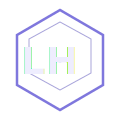

<div align="center">



# Luiz Henrique — Portfólio Pessoal

**Desenvolvedor Web em formação**

[](https://luizsansilv.github.io/Portfolio-pessoal/)
[](https://github.com/luizsansilv)
[](https://linkedin.com/in/lz-henrique)

</div>

---

## 📌 Sobre o projeto

Portfólio pessoal desenvolvido do zero com **HTML, CSS e JavaScript puro**, sem frameworks. O site apresenta minha trajetória, stack tecnológica, projetos em destaque e canais de contato — com foco em design moderno, identidade visual própria e responsividade completa.

---

## ✨ Seções

| Seção | Descrição |
|---|---|
| **Hero** | Apresentação com animação de digitação e logo personalizado |
| **Sobre** | Contexto da jornada na programação |
| **Stack** | Tecnologias com visualização orbital animada |
| **Projetos** | Cards com mockup e links dos projetos |
| **Jornada** | Timeline de evolução profissional |
| **GitHub Dashboard** | Estatísticas de repositórios e linguagens |
| **Contato** | Links para GitHub, LinkedIn e WhatsApp |

---

## 🛠️ Stack


---

## 🎨 Design

- **Identidade visual:** paleta roxa escura com glassmorphism e efeito de estrelas animadas
- **Logo:** hexágono "LH" customizado em SVG
- **Tipografia:** Inter
- **Efeitos:** partículas flutuantes, cursor personalizado, animação orbital na seção de stack
- **Responsivo:** mobile, tablet e desktop

---

## 📂 Estrutura

```
Portfolio-pessoal/
├── index.html
├── styles.css
├── script.js
└── assets/
    ├── logo.svg
    ├── casamento.png
    └── tecno.png
```

---

## 🚀 Como rodar localmente

```bash
# Clone o repositório
git clone https://github.com/luizsansilv/Portfolio-pessoal.git

# Acesse a pasta
cd Portfolio-pessoal

# Abra no navegador
# Basta abrir o index.html diretamente, ou usar a extensão Live Server no VS Code
```

---

## 📁 Projetos em destaque

### 💍 Site de Casamento
Site desenvolvido com HTML, CSS e JavaScript contendo história do casal, confirmação de presença, contagem regressiva e informações do evento.

### 🏢 Redesign de Site Institucional
Redesign de um site para empresa especializada em refrigeração industrial, com foco em identidade visual moderna e navegação clara.

---

## 📬 Contato

Estou aberto a oportunidades de estágio e desenvolvimento web.

- 🌐 [Portfólio](https://luizsansilv.github.io/Portfolio-pessoal/)
- 💼 [LinkedIn](https://linkedin.com/in/lz-henrique)
- 🐙 [GitHub](https://github.com/luizsansilv)
- 💬 [WhatsApp](https://wa.me/5511914898415)

---

<div align="center">

Feito com 💜 por **Luiz Henrique** &nbsp;•&nbsp; © 2026

</div>